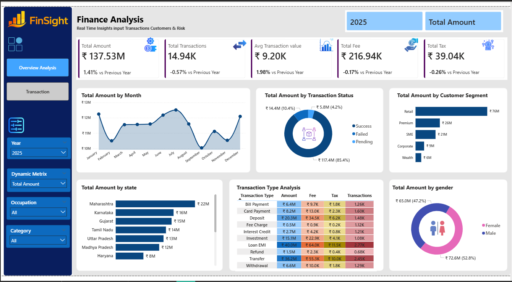
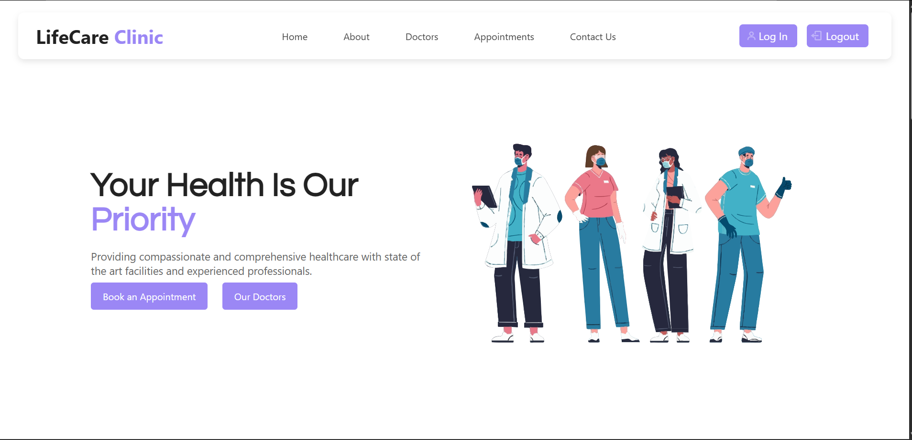

# About Me:
Hi, I’m **Saiprasad Yelde**, a Data Analyst passionate about transforming raw data into actionable insights.
I work on real-world datasets using **Python, SQL, Excel, and Power BI** to solve business problems.
### What things I am doing actually.
1) Analyze structured datasets to uncover trends and patterns
2) Build interactive dashboards and reports for decision-making
3) Clean, validate, and transform data for accurate analysis
4) Perform exploratory data analysis (EDA) and basic statistical analysis

# Socials
<table>
    <td align="center">
      <a href="https://www.instagram.com/mr.sai__045?igsh=MWhrMjNvaWNobXdrdw==" target="_blank">
         
        <b>Instagram</b>
      </a>
    </td>
        <td align="center">
      <a href="https://www.linkedin.com/in/saiprasad-yelde/" target="_blank">
         
        <b>LinkedIn</b>
      </a>
    </td>
    <td align="center">
      <a href="mailto:saiyelde123@gmail.com">
         
        <b>Email</b>
      </a>
    </td>
</table>

# Tech Known and Work With

<table>
  <tr>
    <td align="center">
       
      <b>Python</b>
    </td>
    <td align="center">
       
      <b>NumPy</b>
    </td>
    <td align="center">
       
      <b>Pandas</b>
    </td>
    <td align="center">
       
      <b>Advanced Excel</b>
    </td>
    <td align="center">
       
      <b>Power BI</b>
    </td>
    <td align="center">
       
      <b>Tableau</b>
    </td>
    <td align="center">
       
      <b>Matplotlib</b>
    </td>
    <td align="center">
       
      <b>Seaborn</b>
     <td align="center">
       
      <b>MySQL</b>
    </td>
     <td align="center">
       
      <b>PostgreSQL></b>
  </tr>
</table>

# Projects

### Finance-Analysis-Dashboard

  

Designed and implemented a Finance Analysis Dashboard to evaluate transaction performance, customer behavior, and regional trends across 14.9K+ financial records. Utilized Power BI, DAX, and Power Query to create dynamic visualizations and KPI reports, improving reporting efficiency and supporting strategic business decisions. Delivered actionable insights that helped uncover high-performing customer segments and regional growth opportunities.
- **Tools:** Power BI, Power Query, DAX, Excel, Data Modeling, Data Visualization
- **Project link:**https://github.com/Vijay7972/Medical-Data-Analysis

---

### Hospital Management System (HMS)

  

- Built a full-stack Hospital Management System using Flask and SQLite to digitize patient records, appointment scheduling, and hospital workflows. Implemented secure authentication, admin controls, and a responsive user interface.
Focused on reducing manual paperwork and improving operational efficiency through a centralized, secure platform.

- **Tools:** Python (Flask), SQLite, HTML, CSS, JavaScript
- **Project link:**https://hospital-management-system1-92b2.onrender.com/## 

